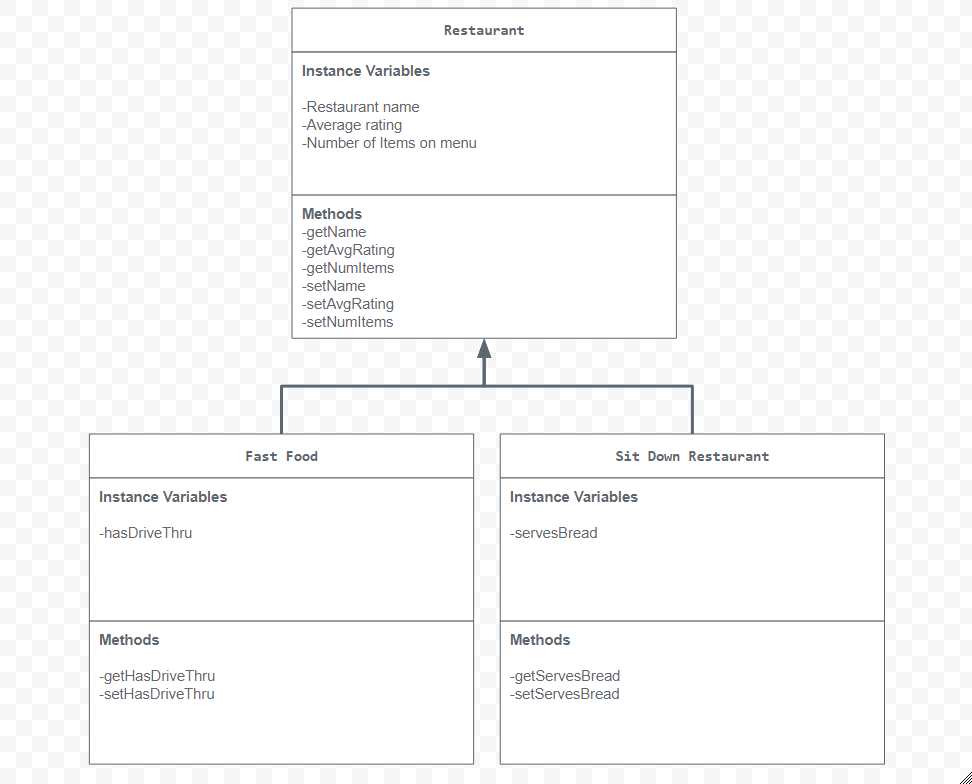

# Unit 2 - Store Management Project

## Introduction

You are opening a new business in your community! Businesses often need programs to manage the products and services they offer and track orders and requests from customers. Your goal is to create a store management system for your business.

## Requirements

Use your knowledge of object-oriented programming and class structure and design to create your store management system:
- **Create a class hierarchy** – Develop a superclass that represents a product or service your business offers and one or more subclasses that extend the superclass to represent more specific types of products or services.
- **Declare instance variables** – Declare instance variables in the superclass that are shared with the subclasses and instance variables in the subclasses that are not shared with the superclass.
- **Write constructors** – Write no-argument and parameterized constructors in the superclass and subclasses. Subclass constructors use the super keyword to call the superclass constructor.
- **Implement accessor and mutator methods** – Write accessor and mutator methods for instance variables that should be accessible and/or modifiable from outside of the class.
- **Implement a toString() method** – Write toString() methods in the superclass and subclasses that return information about the state of an object.

## UML Diagram

Put an image of your UML Diagram here. Upload the image of your UML Diagram to your repository, then use the Markdown syntax to insert your image here.

## Description
My project is a restaurant recommender based on the user's preference of a fast food restaurant or a sit down restaurant. It asks the user if they want to go to a restaurant, and if they say yes, the options to the two types are presented. I chose this topic because restaurants are everywhere, and it is a good job to get while in highschool, which can build important social and work skills. I represented the restaurants by instantiating certain fast food and sit down restaurants with assigned attributes. I had user input in my code, and the user interacted with it by questions being asked to the user. It asked what is your name (String), do you want to go to a restaurant (Boolean), fast food or sit down restaurant (Boolean), and more. If the user says no to the restaurant, the program ends with a friendly message.